# STAT 482 Capstone — Short Report 1
## Predicting Critical and Commercial Success of Book-to-Movie Adaptations

**Authors:** Madhav Thamaran et al.
**Date:** March 2026
**Course:** STAT 482 — Statistical Capstone

---

## Introduction

Every year, film studios adapt novels and short stories into feature films, betting that a book's existing audience and proven narrative will translate into commercial and critical success. Despite this apparent advantage, outcomes vary enormously — some adaptations become celebrated hits while others underperform critically and at the box office. What separates the two? Is it the quality of the source material, its popularity among readers, its genre, or something about how and when the film is released?

This project investigates book-to-movie adaptations released between 2000 and 2024, with the goal of building predictive models for two outcomes: **IMDb audience rating** and **opening weekend box office performance**. We hypothesize that properties of the source book — Goodreads reader rating, publication era, page count, and popularity — combined with film-level attributes such as runtime, MPAA rating, release timing, and distributor, can explain meaningful variation in how adaptations are received.

The specific research goals of this study are:

1. **Predict IMDb rating** using book and film metadata as features.
2. **Predict box office performance** and identify which features drive commercial success.
3. **Identify genre patterns** — do certain genres consistently produce better-received adaptations?
4. **Quantify the book–film quality link** — does a higher Goodreads rating reliably lead to a better film?
5. **Examine temporal and seasonal effects** — does the time between a book's publication and its adaptation, or the month of release, affect outcomes?

Understanding these relationships has practical implications for studios weighing adaptation rights, producers scheduling releases, and researchers studying the cultural pipeline between literature and cinema.

---

## Dataset Description

### Sources and Collection

The dataset was assembled through a multi-stage pipeline. The starting point was four Wikipedia pages documenting fiction-to-feature-film adaptations, scraped programmatically using Python (`requests`, `pandas.read_html`) to produce 3,728 raw book–film pairs. After filtering to films released between 2000 and 2024, 838 candidate pairs remained.

Strict inclusion and exclusion criteria were applied to ensure dataset quality:

- **Included:** English-language theatrical feature films adapted from a single prose novel or short story, with the source book published after 1850.
- **Excluded:** TV films and miniseries; sequels and multi-part franchise entries; adaptations from non-book sources such as screenplays, plays, or video games; non-English-language-only releases; and books published in 1850 or earlier due to insufficient Goodreads metadata coverage.

After deduplication (one adaptation per source book, by normalized title key) and stratified sampling to ensure genre and release-period diversity, the final dataset contains **200 book-to-movie adaptations** spanning release years 2000–2024.

### Feature Enrichment

The base dataset was enriched with metadata from four external sources:

**Goodreads Book Graph (UCSD, 2.36M records):** A streaming fuzzy-matching pipeline was used to link each source book to its Goodreads record using normalized title similarity (threshold ≥ 80/100). This added: average reader rating, ratings count, reviews count, page count, series membership indicator, and book description length. Of 200 titles, **195 were successfully matched**.

**IMDb Non-Commercial Datasets** (`title.basics.tsv`, `title.ratings.tsv`): Film runtime, genre tags, audience rating, and vote count were matched by normalized title similarity (≥ 0.85) and ±1 year release window. **197 of 200 films** were matched.

**TMDb API** (v3, bearer token authentication): Release month and US MPAA certification were retrieved via a search-then-details workflow. **197 of 200 films** were matched.

**Wikidata SPARQL** (property P750 — "distributed by"): Film distributor was retrieved for **192 of 200 films**.

Remaining missing values were filled through manual research by team members. The final dataset has 28 columns across 200 rows.

### Structure and Key Variables

| Category | Variables |
|---|---|
| Book metadata | `book_title`, `book_author`, `book_publication_year`, `book_avg_rating`, `book_ratings_count`, `book_reviews_count`, `book_page_count`, `book_series_indicator`, `book_description_length` |
| Film metadata | `film_title`, `movie_release_year`, `movie_release_month`, `runtime_minutes`, `mpaa_rating`, `distributor`, `movie_genre_raw` |
| Target variables | `imdb_rating`, `imdb_vote_count` |
| Structural | `genre_bucket`, `release_period` |

Source books span publication years 1860–2017 (mean: 1974, SD: 40.2). Films span 2000–2024. The average time between a book's publication and its film release is **38 years** (SD: 41.9), reflecting studios' continued interest in adapting older literary classics alongside recent bestsellers.

---

## Exploratory Data Analysis and Results

### Genre Composition

The 200 adaptations were assigned to nine genre buckets using keyword-based classification of title, author, and IMDb genre tags. As shown in Figure 1, **Drama/Literary Fiction dominates with 53 titles (26.5%)**, followed by Thriller/Mystery/Crime (30, 15%) and Action/Adventure (25, 12.5%). Comedy/Satire is the smallest category with 9 titles (4.5%). This distribution reflects Hollywood's long-standing preference for serious literary fiction and high-tension narratives as adaptation sources.

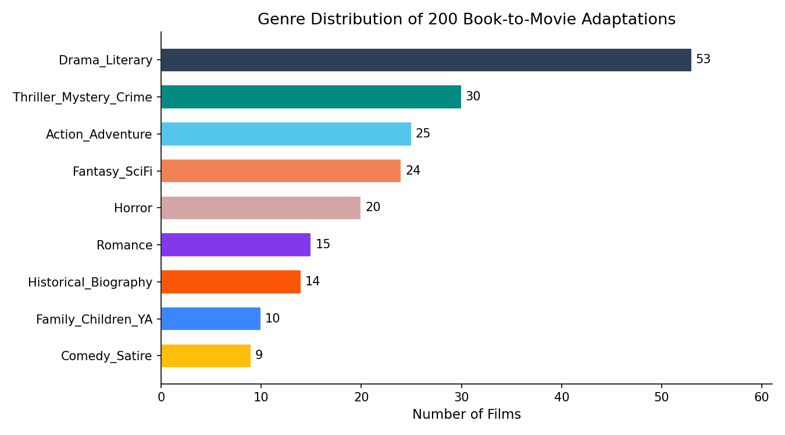
*Figure 1. Genre distribution of 200 book-to-movie adaptations.*

### Temporal Distribution of Films and Books

Film release years (Figure 2) are spread roughly evenly across the 25-year window. The periods 2005–2009 and 2015–2019 are the densest (44 and 45 films respectively). Source book publication decades (Figure 3) show a strong concentration in recent decades — 32.5% of books were published in 2000 or later — while older works (pre-1950) form a smaller share, consistent with most pre-2000 classic adaptations having already been produced in earlier decades.

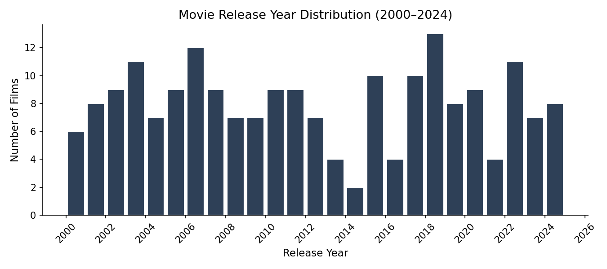
*Figure 2. Distribution of film release years (2000–2024).*

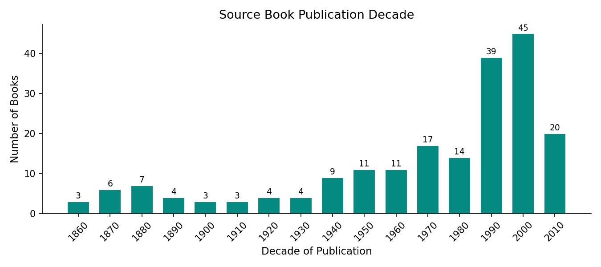
*Figure 3. Source book publication decade.*

### IMDb Rating Distribution

IMDb ratings (Figure 4) are approximately normally distributed with a **mean of 6.19** (SD = 1.14) and a median of 6.3, ranging from 2.3 to 9.0. The concentration between 5.5 and 7.5 suggests that book adaptations tend to produce competent but rarely exceptional films — the source material raises the floor through narrative structure while production variance determines the ceiling. Fewer than 10% of adaptations exceed a rating of 7.5.

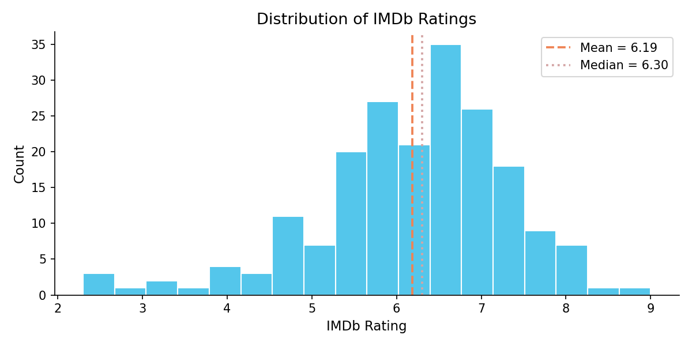
*Figure 4. Distribution of IMDb ratings.*

### Goodreads Book Rating Distribution

Goodreads ratings (Figure 5) are tightly clustered between 3.5 and 4.5, with a **mean of 3.89** (SD = 0.30). This compressed range is characteristic of the Goodreads platform, where reader self-selection inflates ratings toward the upper-middle of the 1–5 scale. The lack of spread may limit this feature's standalone predictive power, though it may contribute meaningful signal in combination with ratings volume.

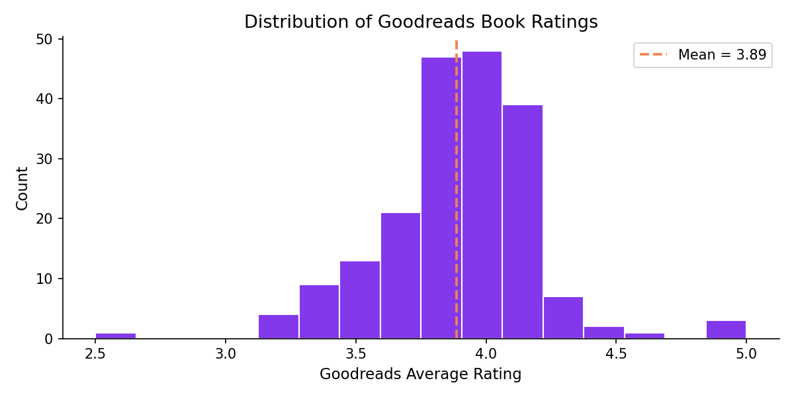
*Figure 5. Distribution of Goodreads average book ratings.*

### Book Rating vs. IMDb Rating

Figure 6 plots Goodreads book rating against IMDb film rating, colored by genre. The Pearson correlation is **r = 0.135** — a weak positive association. A beloved book does not reliably produce a highly-rated film, consistent with the view that the qualities that make prose compelling (internal monologue, layered subplots, descriptive depth) are often difficult to translate to screen. By contrast, IMDb vote count correlates much more strongly with IMDb rating (**r = 0.511**), suggesting that critically successful films attract larger audiences rather than the reverse, and that production scale and marketing reach may be more determinative than source material quality.

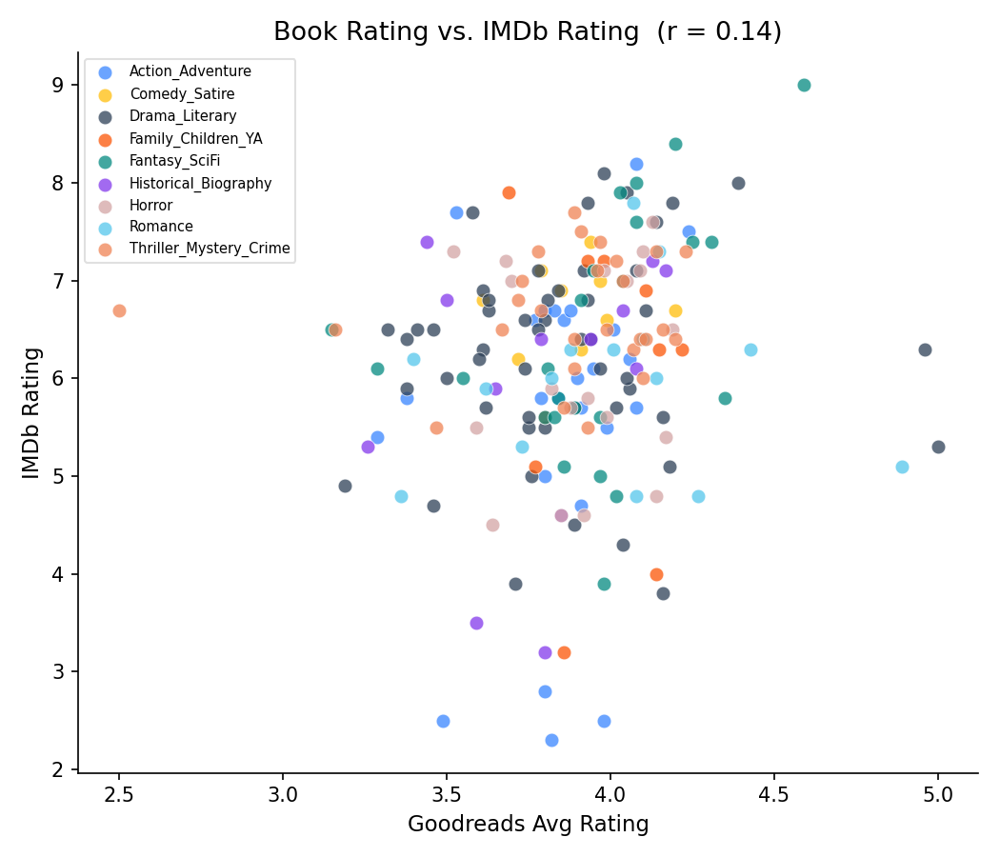
*Figure 6. Goodreads book rating vs. IMDb film rating (r = 0.135), colored by genre.*

### IMDb Rating by Genre

Figure 7 displays IMDb rating distributions by genre, ordered by median. **Historical/Biography adaptations achieve the highest median rating (~6.9)**, followed by Action/Adventure and Thriller/Mystery/Crime. Comedy/Satire and Romance show lower medians. Horror spans the widest range — a handful of critically acclaimed entries elevate the median while low-budget productions bring it down. Genre differences are substantial enough to warrant inclusion as a categorical feature in predictive models.

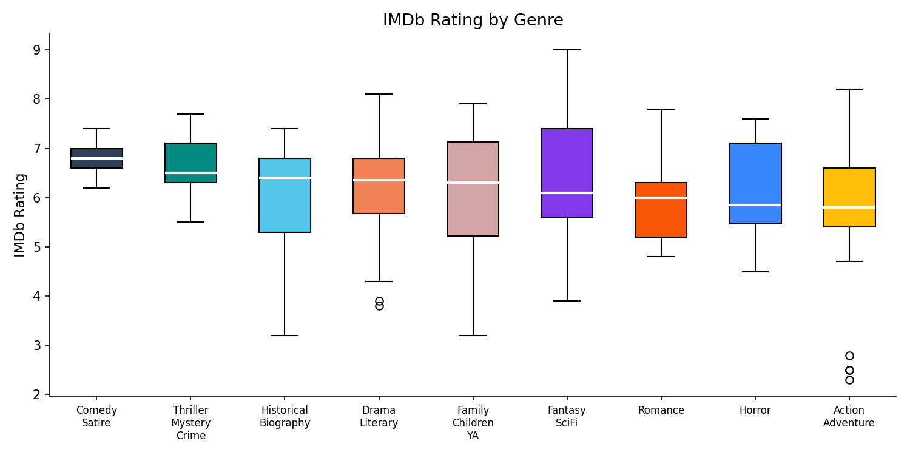
*Figure 7. IMDb rating by genre bucket.*

### MPAA Rating

Of the 167 films with a US MPAA classification (Figure 8), **78.4% are rated R or PG-13**. R-rated films (68, 40.7%) and PG-13 films (63, 37.7%) dominate, reflecting the adult-oriented nature of most literary fiction. Only 24 films are PG and 4 are G. MPAA rating is a proxy for content maturity and target audience demographics, and we expect it to correlate with both IMDb ratings and box office stratification.

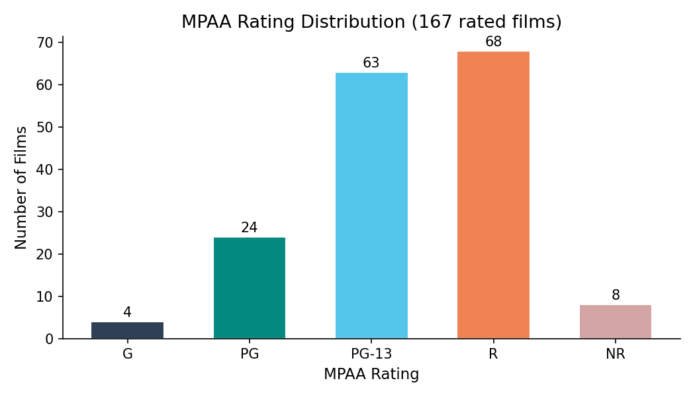
*Figure 8. MPAA rating distribution (167 rated films).*

### Release Seasonality

Figure 9 shows that **September is the most common release month (26 films, 13.2%)**, followed by February (21) and August (19). September releases are typically positioned for awards-season consideration (Golden Globes, Oscars), while February captures the Valentine's Day market for Romance and Drama films. Summer months (June–July) are surprisingly sparse, likely because major franchise blockbusters — which tend to be non-literary adaptations or sequels — crowd out adaptation releases in those slots.

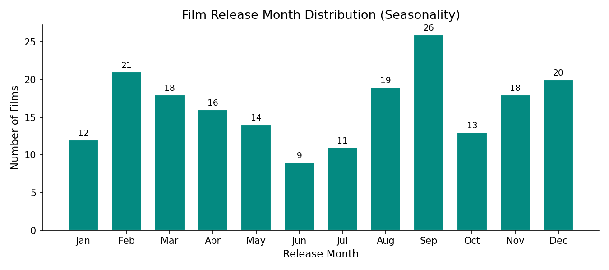
*Figure 9. Film release month distribution.*

### Runtime Distribution

Runtimes (Figure 10) average **113.7 minutes** (SD = 20.6), ranging from 61 to 201 minutes. Runtime correlates moderately with IMDb rating (**r = 0.526**), the strongest single correlate in the dataset. This likely reflects that longer films signal larger budgets, prestige productions, and greater creative ambition — all of which tend to produce higher-quality outcomes — rather than runtime directly causing better ratings.

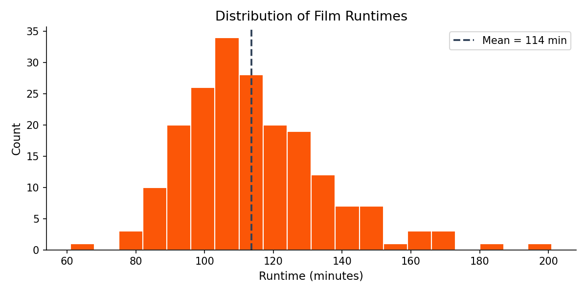
*Figure 10. Distribution of film runtimes.*

### Distributors

Figure 11 shows the top 12 distributors. Warner Bros., Sony Pictures, and Universal Pictures each distributed more than 10 adaptations. Major studio representation is expected given that large studios have both the capital to acquire adaptation rights and the marketing infrastructure to maximize opening weekend performance. Distributor identity will serve as a proxy for production budget in our models.

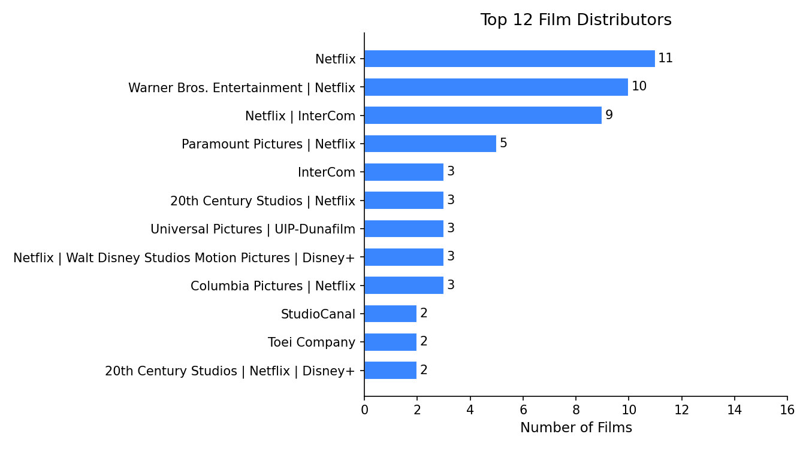
*Figure 11. Top 12 distributors.*

### Book Characteristics

Source books have a median page count of **304 pages** (Figure 13), ranging from 12 to 1,137. Longer books may present greater adaptation challenges but also signal richer narrative content. Approximately **33% of source books are part of a series**, reflecting studios' preference for franchisable intellectual property with built-in sequel potential.

IMDb vote counts (Figure 14) span several orders of magnitude — from under 1,000 to over 2 million — and their log-transformed distribution (log₁₀ scale) is approximately normal, confirming that vote count should be log-transformed before use in linear models.

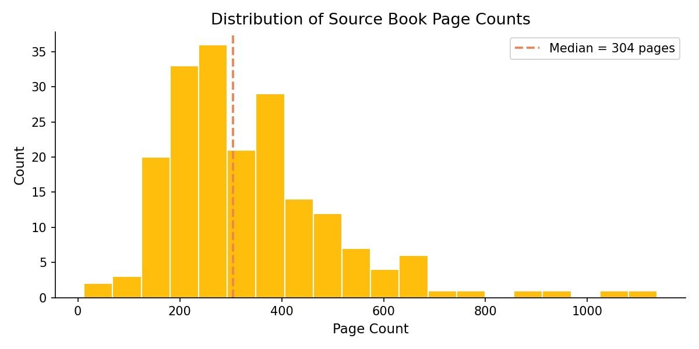
*Figure 13. Distribution of source book page counts.*

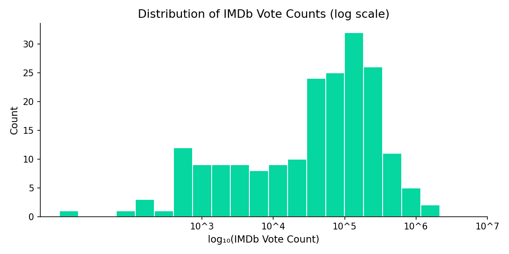
*Figure 14. IMDb vote count distribution (log₁₀ scale).*

### Missing Data

Figure 12 summarizes missingness across key fields. `mpaa_rating` has the highest missing rate (16.5%), concentrated among foreign-language and streaming-only releases with no US MPAA classification. All core predictors (`imdb_rating`, `imdb_vote_count`, `runtime_minutes`) are missing in 2% or fewer rows. Book metadata is missing only for the 5 titles with no Goodreads presence, all non-English-origin works.

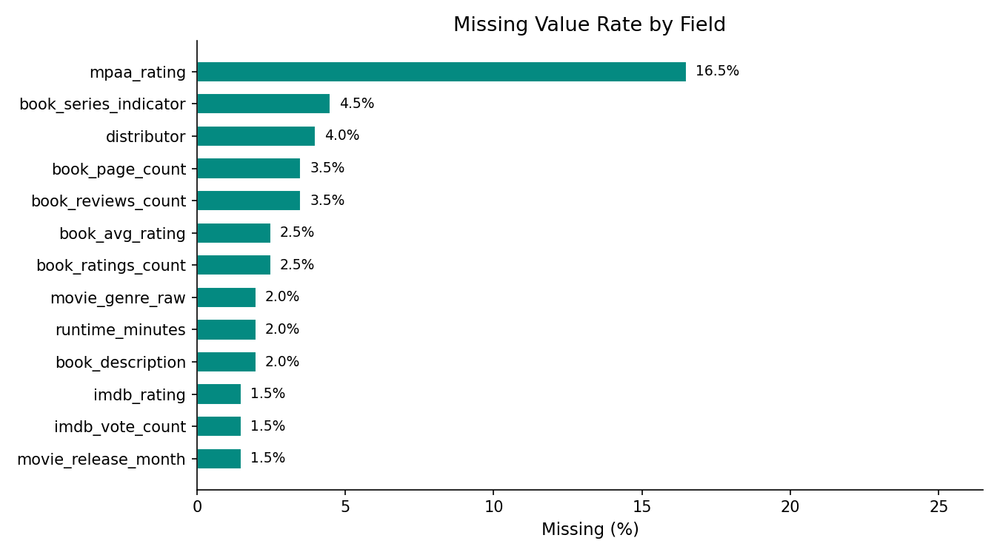
*Figure 12. Missing value rate by field.*

### Summary of EDA Findings

| Finding | Implication for Modeling |
|---|---|
| IMDb ratings cluster around 6.2 (mean), SD = 1.14 | Regression is appropriate; sufficient variance to predict |
| Book rating weakly correlated with IMDb (r = 0.14) | Book quality alone is insufficient; need richer feature set |
| Runtime strongly correlated with IMDb (r = 0.53) | Include runtime; consider as budget proxy |
| Vote count strongly correlated with IMDb (r = 0.51) | Log-transform vote count for linear models |
| Historical/Biography genre earns highest median IMDb | Genre is a meaningful predictor; encode as categorical |
| September is peak release month | Release timing matters; include month or season |
| 78% of rated films are R or PG-13 | MPAA rating captures audience segmentation |
| 33% of source books are part of a series | Series indicator may predict franchise box office |

---

*Dataset: `book_movie_adaptations_final_200.csv` — 200 rows × 28 columns*
*Data sources: Wikipedia, Goodreads Book Graph (UCSD), IMDb Non-Commercial Datasets, TMDb API, Wikidata*
