# STAT 482 Capstone - Report Draft 1
## Predicting Critical and Commercial Success of Book-to-Movie Adaptations

**Authors:** Madhav Thamaran, Aarya Kanuru, Jennifer Puente
**Date:** March 2026
**Course:** STAT 482 - Statistical Capstone

---

## Introduction

Every year, studios turn novels and short stories into movies, hoping that a strong existing story and built-in audience will lead to success. Sometimes that works really well, and sometimes it does not. Some adaptations become critically acclaimed and commercially successful, while others perform poorly with both audiences and critics. This raises an interesting question: what makes one book-to-movie adaptation succeed while another falls short?

This project studies book-to-movie adaptations released between 2000 and 2024. The main goal is to build predictive models for two outcomes: **IMDb audience rating** and **opening weekend box office performance**. We want to see whether characteristics of the original book, such as Goodreads rating, popularity, page count, and publication year, along with film-level features like runtime, MPAA rating, release month, and distributor, can help explain variation in movie success.

The main research questions are:

1. **Can we predict IMDb rating** using book and movie metadata?
2. **Can we predict box office performance** and identify which variables matter most?
3. **Are there genre patterns** in adaptation success?
4. **Is there a relationship between book quality and film quality**?
5. **Do timing effects matter**, such as release month or the number of years between publication and adaptation?

This project is useful because it connects literary popularity with movie outcomes in a measurable way. It could be helpful for studios deciding which books to adapt, producers deciding when to release films, and researchers interested in how stories move from literature to film.

---

## Dataset Description

### Sources and Collection

The dataset was built through a multi-step collection and cleaning process. We started with four Wikipedia pages listing fiction-to-feature-film adaptations. Using Python tools such as `requests` and `pandas.read_html`, we scraped **3,728 raw book-film pairs**. After filtering to films released between 2000 and 2024, we were left with **838 candidate pairs**.

We then applied several inclusion and exclusion rules to improve quality and consistency.

**Included:**
- English-language theatrical feature films
- Adaptations from a single prose novel or short story
- Source books published after 1850

**Excluded:**
- TV movies and miniseries
- Sequels and multi-part franchise entries
- Adaptations from non-book sources like plays, screenplays, or video games
- Movies without an English-language release
- Books published in 1850 or earlier, since Goodreads metadata coverage was much weaker for those works

After deduplication and stratified sampling to maintain variety across genres and release periods, the final dataset contains **200 book-to-movie adaptations** released between 2000 and 2024.

### Feature Enrichment

The original dataset was then enriched using several outside data sources.

**Goodreads Book Graph (UCSD, 2.36 million records):**  
We used a fuzzy-matching pipeline to link each source book to a Goodreads record based on normalized title similarity, using a threshold of 80 out of 100. This gave us features such as average reader rating, ratings count, reviews count, page count, whether the book belongs to a series, and book description length. Out of 200 books, **195 were successfully matched**.

**IMDb Non-Commercial Datasets (`title.basics.tsv`, `title.ratings.tsv`):**  
We matched films using normalized title similarity and a release year window of plus or minus 1 year. This added runtime, genre tags, IMDb rating, and vote count. **197 out of 200 films** were matched.

**TMDb API:**  
We used a search-and-details workflow to get release month and US MPAA certification. **197 out of 200 films** were matched here as well.

**Wikidata SPARQL:**  
Using property P750, "distributed by," we collected distributor information for **192 out of 200 films**.

Any remaining missing values were filled manually through additional research. The final dataset contains **28 columns and 200 rows**.

### Structure and Key Variables

| Category | Variables |
|---|---|
| Book metadata | `book_title`, `book_author`, `book_publication_year`, `book_avg_rating`, `book_ratings_count`, `book_reviews_count`, `book_page_count`, `book_series_indicator`, `book_description_length` |
| Film metadata | `film_title`, `movie_release_year`, `movie_release_month`, `runtime_minutes`, `mpaa_rating`, `distributor`, `movie_genre_raw` |
| Target variables | `imdb_rating`, `imdb_vote_count` |
| Structural | `genre_bucket`, `release_period` |

The books in the dataset were published between **1860 and 2017**, with a mean publication year of **1974** and a standard deviation of **40.2 years**. The movies span **2000 to 2024**. On average, the time gap between book publication and movie release is **38 years** with a standard deviation of **41.9 years**, showing that studios adapt both recent books and much older works.

---

## Exploratory Data Analysis and Results

### Genre Composition

The 200 adaptations were grouped into nine genre buckets using keywords from the title, author, and IMDb genre tags. As shown in Figure 1, **Drama/Literary Fiction is the largest category with 53 films (26.5%)**, followed by Thriller/Mystery/Crime with 30 films (15%) and Action/Adventure with 25 films (12.5%). Comedy/Satire is the smallest group with only 9 films (4.5%).

This suggests that Hollywood especially favors serious literary stories and high-stakes narratives when selecting books for adaptation.

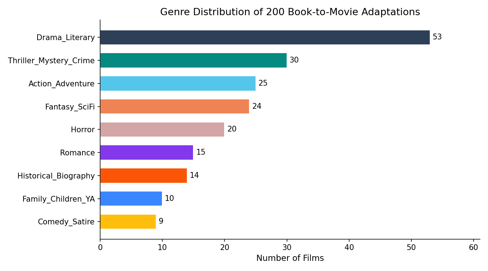  
*Figure 1. Genre distribution of 200 book-to-movie adaptations.*

### Temporal Distribution of Films and Books

Movie release years are spread fairly evenly across the 2000-2024 period. The release periods **2005-2009** and **2015-2019** are the most common, with 44 and 45 films respectively.  

Book publication decades show a stronger concentration in recent years. About **32.5% of source books were published in 2000 or later**, while much older books make up a smaller share. This makes sense, since many classic works were already adapted before 2000.

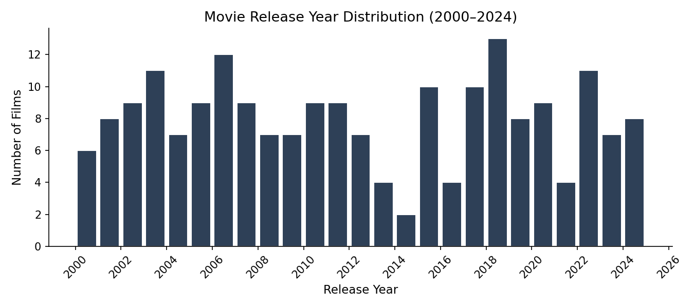  
*Figure 2. Distribution of film release years (2000-2024).*

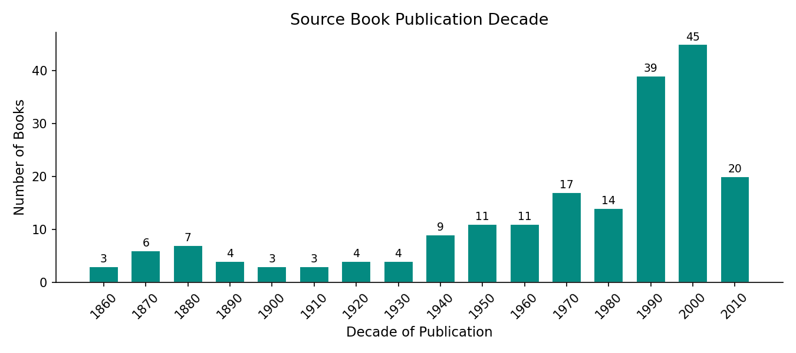  
*Figure 3. Source book publication decade.*

### IMDb Rating Distribution

IMDb ratings are roughly bell-shaped, with a **mean of 6.19**, a standard deviation of **1.14**, and a median of **6.3**. Ratings range from **2.3 to 9.0**. Most movies fall between about **5.5 and 7.5**, which suggests that adaptations are usually decent but not often exceptional.

In other words, adapting a book may give a film a stronger starting point, but it does not guarantee a great result.

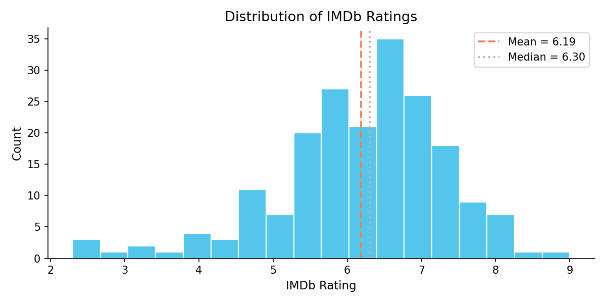  
*Figure 4. Distribution of IMDb ratings.*

### Goodreads Book Rating Distribution

Goodreads book ratings are much more tightly clustered. The mean is **3.89** with a standard deviation of **0.30**, and most books fall between **3.5 and 4.5**. This compressed range is typical of Goodreads, where readers are more likely to rate books they already chose to read and often rate them fairly positively.

Because of that, Goodreads rating may not be a very strong predictor by itself, but it could still be useful when combined with other variables.

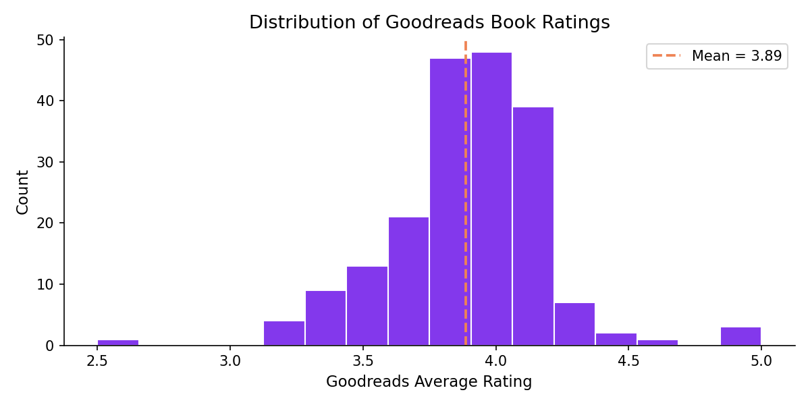  
*Figure 5. Distribution of Goodreads average book ratings.*

### Book Rating vs. IMDb Rating

Figure 6 compares Goodreads rating to IMDb film rating. The Pearson correlation is **r = 0.135**, which is a weak positive relationship. So, while better-rated books may produce slightly better-rated movies on average, the connection is not very strong.

This makes sense because what works well in a novel does not always work as well on screen. Books can rely on internal thoughts, pacing, and detailed description in ways that movies cannot.

By comparison, IMDb vote count has a much stronger correlation with IMDb rating at **r = 0.511**. That suggests that more successful or higher-profile films tend to attract more viewers and votes.

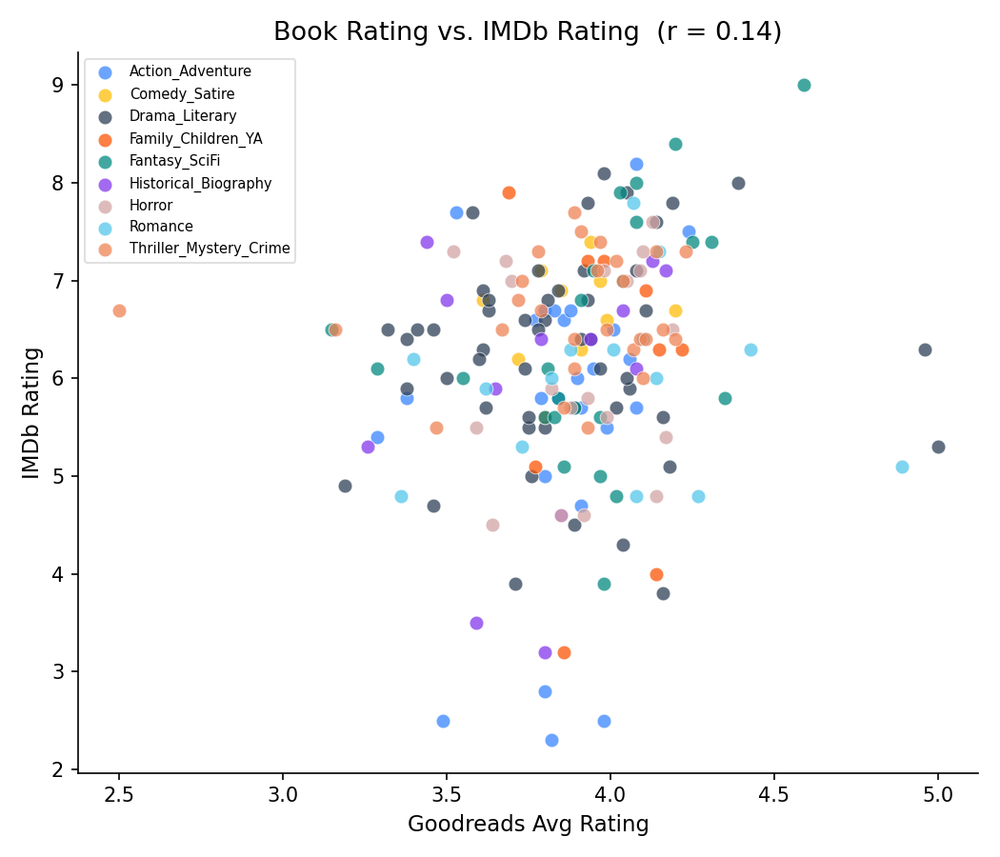  
*Figure 6. Goodreads book rating vs. IMDb film rating (r = 0.135), colored by genre.*

### IMDb Rating by Genre

Figure 7 shows IMDb rating distributions by genre. **Historical/Biography adaptations have the highest median rating, around 6.9**, followed by Action/Adventure and Thriller/Mystery/Crime. Comedy/Satire and Romance have lower medians.

Horror has the widest spread, which suggests the genre is more hit-or-miss. Some horror adaptations are highly rated, while others perform very poorly. Overall, genre clearly matters enough that it should be included as a categorical predictor in our models.

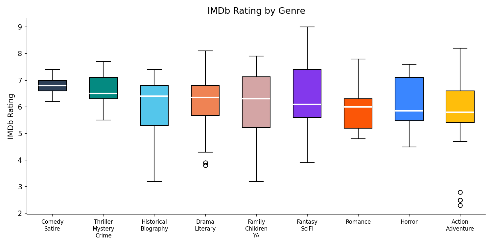  
*Figure 7. IMDb rating by genre bucket.*

### MPAA Rating

Among the **167 films with a US MPAA rating**, **78.4% are either R or PG-13**. Specifically, 68 films are rated R (40.7%) and 63 are rated PG-13 (37.7%). Only 24 are PG and just 4 are G.

This makes sense because many book adaptations, especially in drama and literary fiction, deal with more mature material. MPAA rating may be useful as a predictor because it reflects both content level and intended audience.

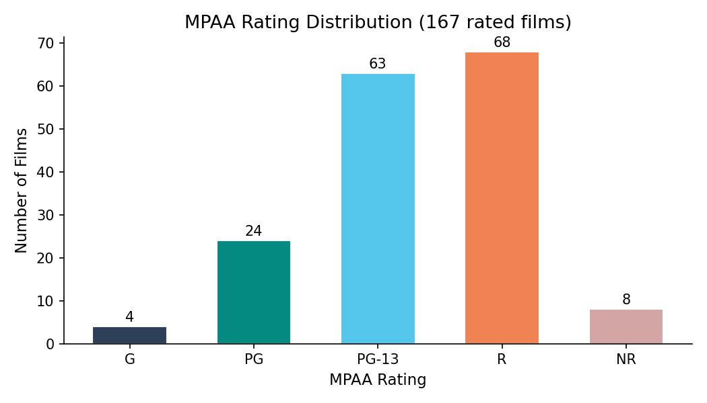  
*Figure 8. MPAA rating distribution (167 rated films).*

### Release Seasonality

Release month also shows some patterns. **September is the most common release month with 26 films (13.2%)**, followed by February with 21 and August with 19.

September releases are often connected to awards season, while February may be attractive for dramas and romances around Valentine’s Day. Summer months like June and July appear less often, which may be because those months are crowded with large franchise blockbusters rather than literary adaptations.

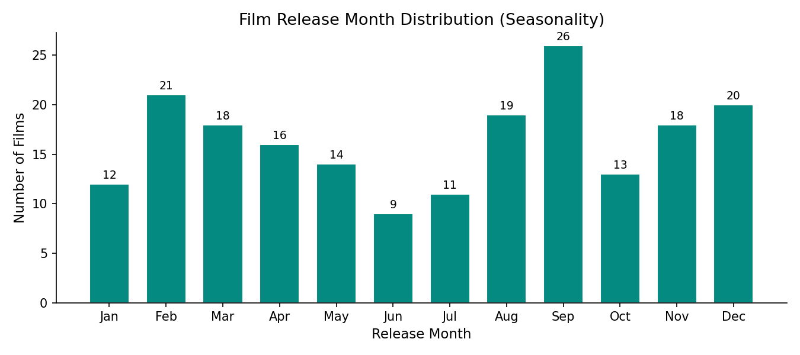  
*Figure 9. Film release month distribution.*

### Runtime Distribution

Movie runtimes average **113.7 minutes**, with a standard deviation of **20.6 minutes**, and range from **61 to 201 minutes**. Runtime has a moderately strong positive correlation with IMDb rating, **r = 0.526**, which is the strongest single correlation in the dataset.

This does not necessarily mean longer movies are better because they are longer. More likely, runtime is acting as a proxy for things like production scale, prestige, or creative ambition.

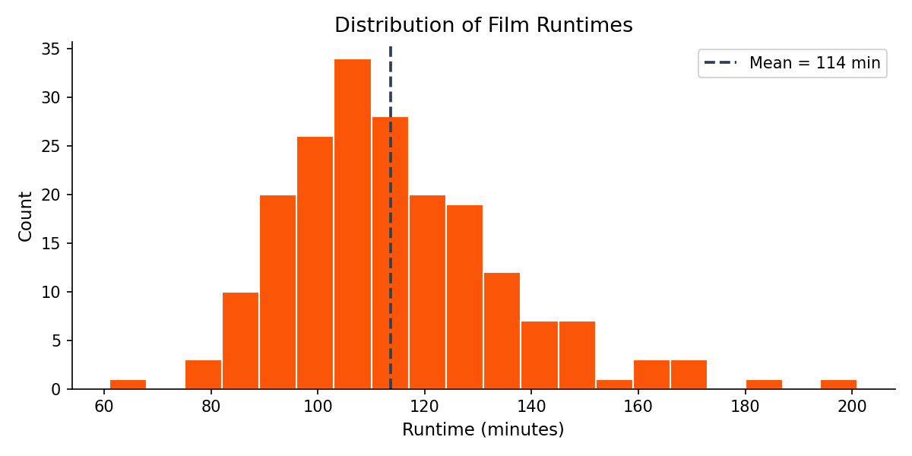  
*Figure 10. Distribution of film runtimes.*

### Distributors

Figure 11 shows the most common distributors. Warner Bros., Sony Pictures, and Universal Pictures each appear more than 10 times. This is not surprising, since major studios are more likely to have the money to buy adaptation rights and market films heavily.

Distributor may therefore act as an indirect measure of production resources or expected commercial reach.

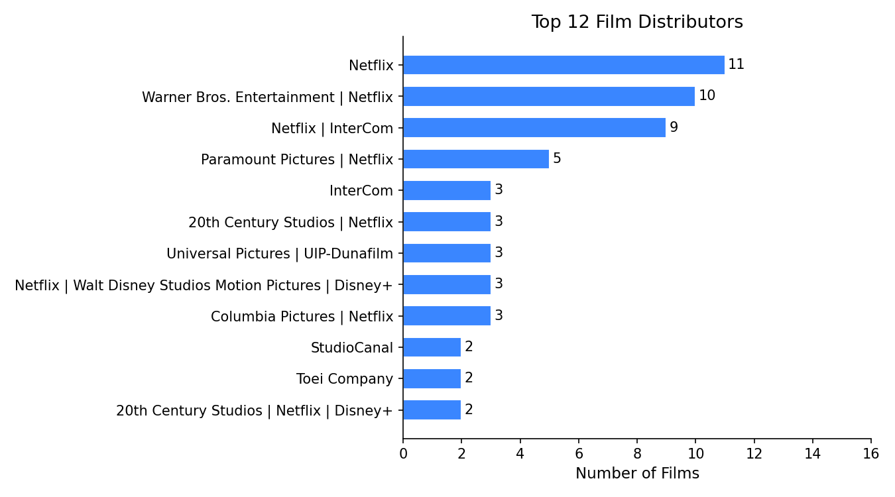  
*Figure 11. Top 12 distributors.*

### Book Characteristics

The median source book page count is **304 pages**, with values ranging from **12 to 1,137 pages**. Longer books could be harder to adapt because of how much material needs to be condensed, but they might also provide richer stories.

About **33% of source books are part of a series**, which suggests that studios often prefer books with franchise potential.

IMDb vote counts cover a very wide range, from fewer than 1,000 votes to over 2 million. After applying a log base-10 transformation, the distribution becomes much more normal, so vote count should probably be log-transformed before using it in linear models.

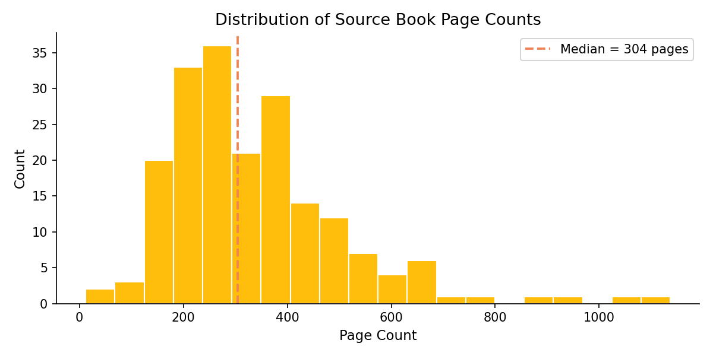  
*Figure 13. Distribution of source book page counts.*

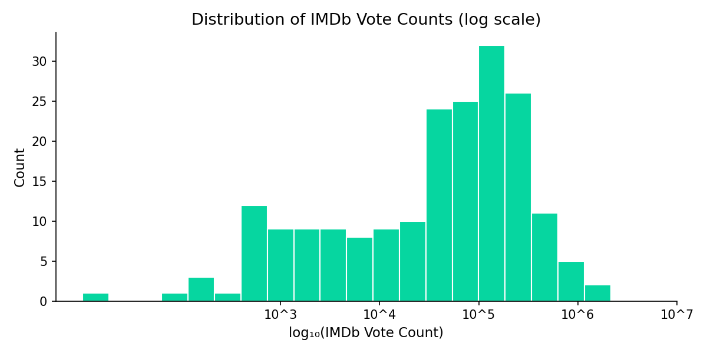  
*Figure 14. IMDb vote count distribution (log₁₀ scale).*

### Missing Data

Figure 12 summarizes missingness across the main fields. `mpaa_rating` has the highest missing rate at **16.5%**, mostly because some films did not receive a US MPAA classification, especially foreign-language or streaming-oriented releases. The most important predictors, such as `imdb_rating`, `imdb_vote_count`, and `runtime_minutes`, are missing in **2% or fewer rows**.

Book metadata is missing mainly for the small number of titles that could not be matched to Goodreads.

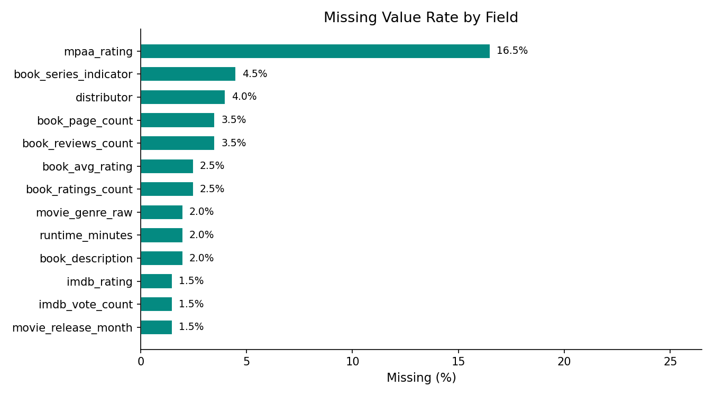  
*Figure 12. Missing value rate by field.*

### Summary of EDA Findings

| Finding | Implication for Modeling |
|---|---|
| IMDb ratings center around 6.2 with reasonable spread | Regression is appropriate and there is enough variation to model |
| Goodreads book rating has only a weak correlation with IMDb rating (r = 0.14) | Book quality alone is not enough; more predictors are needed |
| Runtime is strongly correlated with IMDb rating (r = 0.53) | Runtime should definitely be included |
| Vote count is also strongly correlated with IMDb rating (r = 0.51) | Log-transform vote count before modeling |
| Historical/Biography has the highest median IMDb rating | Genre should be included as a categorical variable |
| September is the most common release month | Release timing may matter |
| Most rated films are R or PG-13 | MPAA rating may capture audience targeting |
| About one-third of books are in a series | Series membership may help predict box office success |

---

*Dataset: `book_movie_adaptations_final_200.csv` - 200 rows × 28 columns*  
*Data sources: Wikipedia, Goodreads Book Graph (UCSD), IMDb Non-Commercial Datasets, TMDb API, Wikidata*