# Report 2: Film Characteristics and Box Office Success
**Authors:** Madhav Thamaran, Aarya Kanuru, Jennifer Puente
**Date:** April 12, 2026
**Course:** STAT 482 - Statistical Capstone

---

## 1. Introduction

The global film industry generates hundreds of billions of dollars annually, yet predicting which films will succeed remains notoriously difficult. Producers, studios, and distributors must commit massive budgets before a single ticket is sold, making the identification of reliable predictors of success both practically and academically valuable.

This report investigates the following primary research question: **What film characteristics are associated with critical and commercial success among the top-grossing films of all time?** We operationalize critical success as IMDb user rating — a widely used proxy for audience and critical reception — and commercial success as the natural log of domestic box office gross. The predictors we examine include genre, runtime, MPAA rating, release timing, and decade of release.

As a secondary exploratory question, we also examine whether **book adaptations** show different patterns of critical or commercial performance compared to other films. This comparison is treated as descriptive and motivates future modeling work.

The dataset consists of the 500 highest-grossing domestic films of all time (as of 2024), enriched with metadata from IMDb, TMDb, Wikidata, and the UCSD Goodreads book dataset. Because all films in this sample are commercially successful by definition, our analysis focuses on variation in degree of success rather than success versus failure.

---

## 2. Data

The base dataset is a ranked list of the 500 highest-grossing domestic films, spanning releases from 1937 to 2026. Film-level metadata was collected from multiple sources via automated pipelines:

| Feature | Source | Coverage |
|---|---|---|
| IMDb Rating | IMDb Non-Commercial Bulk TSVs | 497 / 500 |
| Runtime (minutes) | IMDb Non-Commercial Bulk TSVs | 499 / 500 |
| MPAA Rating | TMDb REST API | 491 / 500 |
| Release Month | TMDb REST API | 492 / 500 |
| is_book (binary) | Wikipedia + manual verification | 500 / 500 |
| Goodreads features | UCSD Goodreads Dataset (2019) | 74 / 74 book films |

Of the 500 films, **74 (14.8%)** are confirmed adaptations of literary works. Goodreads data (average rating, ratings count, page count, series indicator) was matched to these 74 films using fuzzy title matching against the 2.36 million-entry UCSD Goodreads dataset, with remaining unmatched entries filled manually.

Domestic gross values range from \$140M to \$937M (median: \$203M). Due to right skew and the multiplicative nature of box office revenue, all analyses use the natural log of domestic gross as the commercial outcome.

---

## 3. Exploratory Data Analysis

### 3.1 Outcome Variable Distributions

IMDb ratings in this sample range from 4.2 to 9.1, with a mean of **7.07** and standard deviation of **0.80**. The distribution is roughly symmetric and concentrated between 6.5 and 8.0. This compressed range reflects a selection effect: all 500 films were commercially successful enough to reach the top-500 list, which filters out the lowest-rated films.

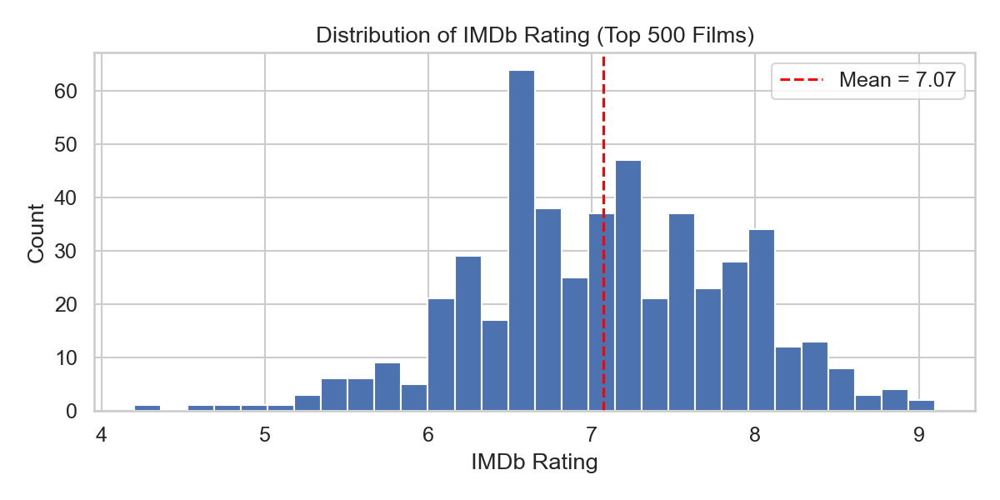

Log-transformed domestic gross values are approximately normally distributed, with a mean of **19.26** (corresponding to ~\$231M). The log transformation substantially reduces the right skew present in raw gross values, making it more suitable for linear modeling.

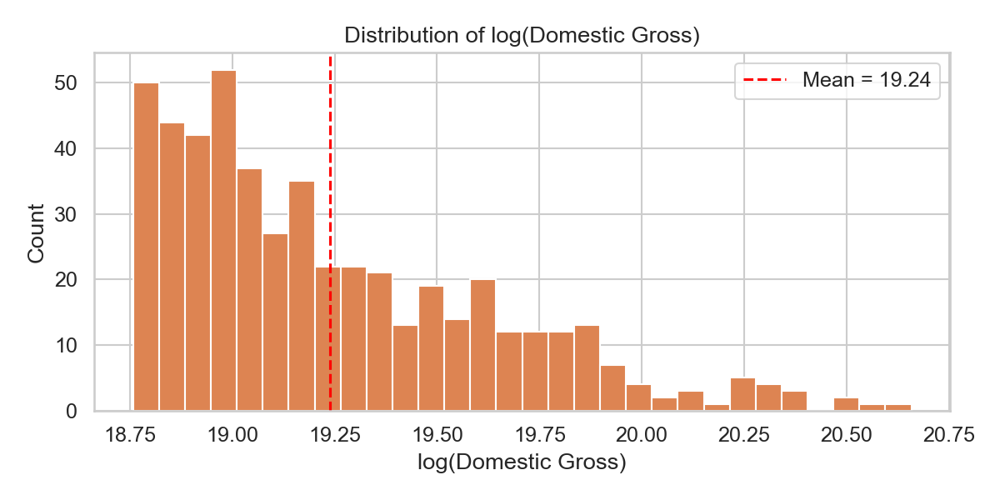

### 3.2 Genre

Genre is the most important categorical predictor. Action films make up the largest share of the top 500 (258 / 500, 51.6%), followed by Adventure (123), Comedy (53), and Drama (32). Drama films have the highest mean IMDb rating among genres with at least 10 films in the sample, while Action and Comedy films cluster near the overall mean. For box office, Action and Adventure films dominate by count, but Biography films underperform commercially relative to Action.

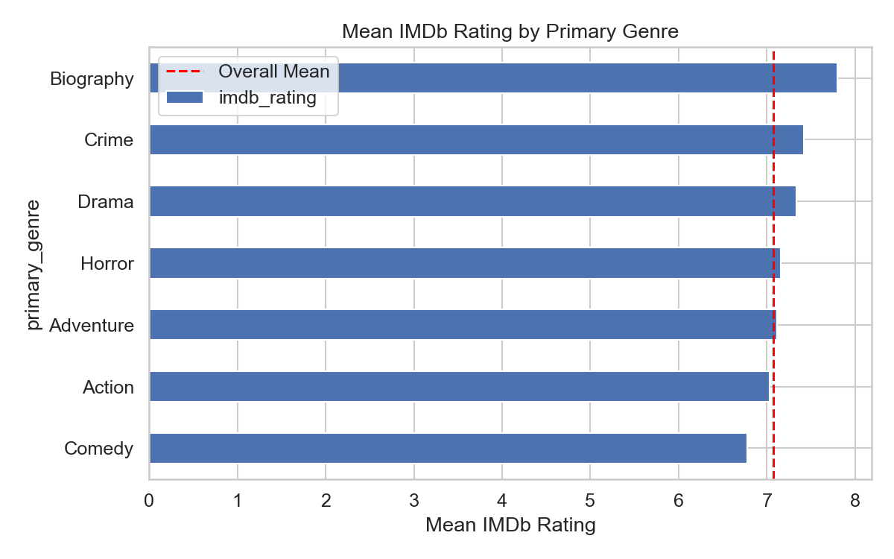

### 3.3 Runtime

Runtime is the strongest continuous predictor of both outcomes:

- Correlation with IMDb rating: **r = 0.27**
- Correlation with log(gross): **r = 0.25**

The mean runtime across all 500 films is 121.5 minutes (SD = 24.0). The positive relationship with IMDb rating likely reflects a genre confound — epic Action and Adventure films tend to be long, receive high engagement, and also earn more — rather than a direct effect of runtime itself.

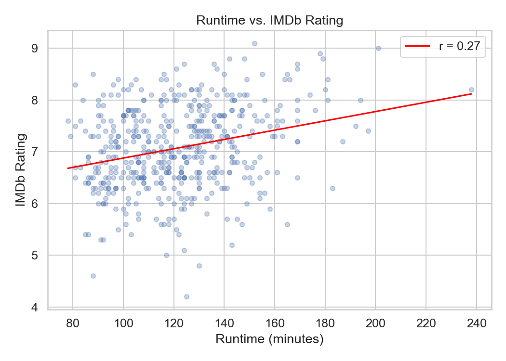

### 3.4 MPAA Rating

G-rated films have the highest mean IMDb rating (7.58), driven by a small number of classic animated films (e.g., Snow White, Bambi) that have aged well in public estimation. PG-13 is the most common rating (258 films) and earns the most at the box office on average, reflecting its broader audience reach. R-rated films earn significantly less than PG-13 films in this sample.

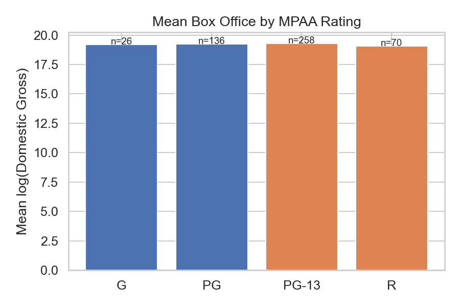

### 3.5 Release Month

Summer (May–July) and holiday (November–December) releases dominate the top-500 list, accounting for 289 of 492 dated films (58.7%). May–July films include the bulk of summer blockbusters, while November–December captures awards-season and holiday family releases. January and August are the weakest months, typically used for lower-priority studio releases. Release month has minimal correlation with IMDb rating (r = 0.13) but a modest commercial association, with April showing the highest mean log gross.

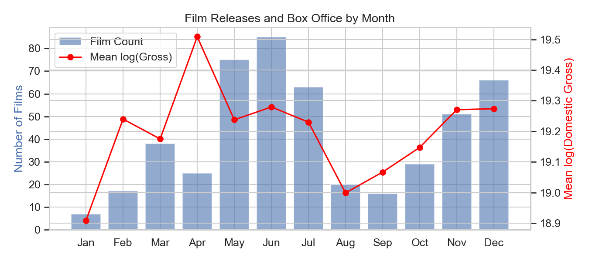

### 3.6 Temporal Trends

Films from the 1970s and 1980s carry higher mean IMDb ratings than those from the 2000s and 2010s, despite the latter decades dominating by count. This reflects survivorship bias: older films that remain on all-time lists have already been filtered for quality. Mean log(gross) is relatively stable across decades in nominal terms, though real-dollar trends would show growth.

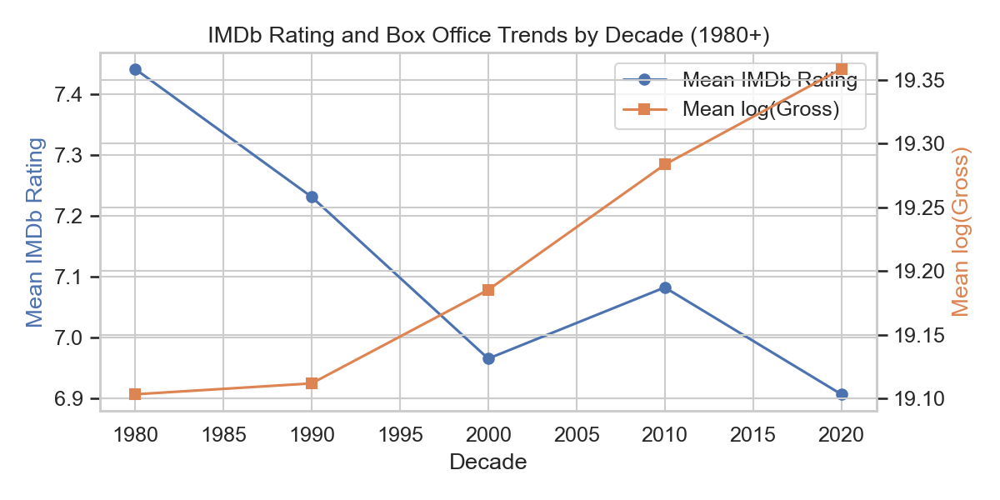

### 3.7 Correlation Summary

The heatmap below summarizes pairwise correlations among all key numeric variables. Runtime, IMDb rating, and log(gross) form a moderate positive cluster. `is_book` has near-zero raw correlation with both outcomes. Decade has a slight negative correlation with IMDb rating (newer films rate slightly lower in this sample) and a slight positive correlation with log(gross) (reflecting nominal dollar growth over time).

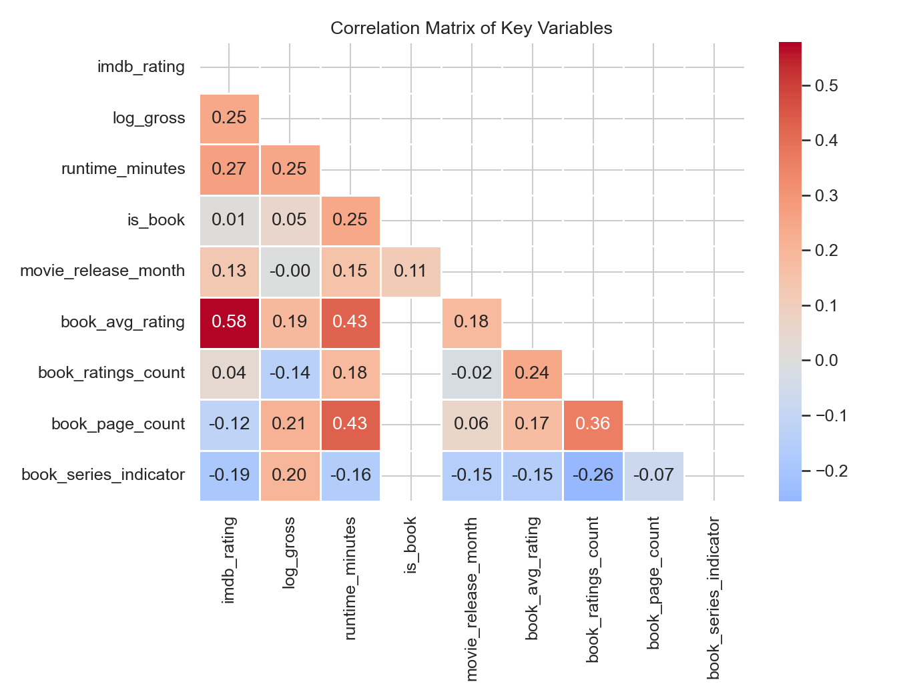

---

### 3.8 Book Adaptations: Exploratory Comparison

As a secondary descriptive question, we examined whether book adaptations differ from other films in this sample. Across 74 book adaptations and 426 other films:

| Metric | Book Adaptations | Other Films | t-statistic | p-value |
|---|---|---|---|---|
| Mean IMDb Rating | 7.09 | 7.07 | 0.17 | 0.87 |
| Mean log(Domestic Gross) | 19.29 | 19.23 | 1.20 | 0.23 |
| Mean Runtime (min) | 135.7 | 119.1 | — | — |

Neither difference in IMDb rating nor box office gross is statistically significant. Book adaptations do not outperform other films on either outcome in this sample, before controlling for any other variables. The most notable difference is runtime: book adaptations are on average **16.6 minutes longer** than non-adaptations, which likely reflects their genre composition (Drama: 44% adaptations; Action: 12% adaptations).

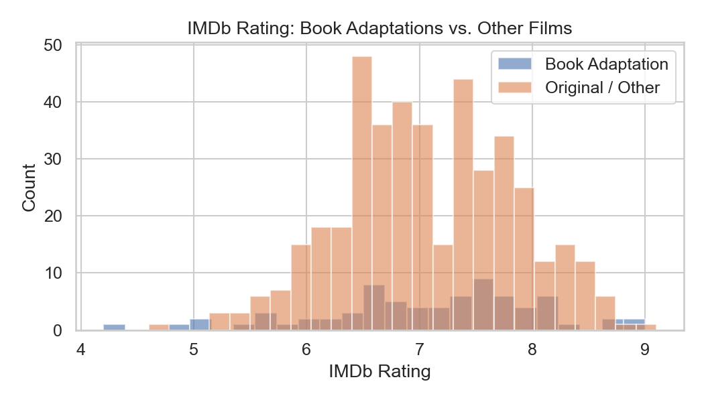

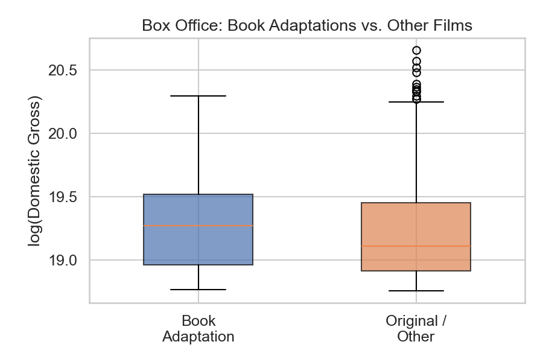

Among the 74 book adaptations specifically, Goodreads average rating shows a moderate positive correlation with IMDb rating (**r = 0.578**, n = 73). This suggests that the quality of the source material — as perceived by book readers — has a meaningful relationship with how the film is received by audiences. The correlation with box office is weaker (r = 0.19), indicating that book quality translates more to critical than commercial film reception.

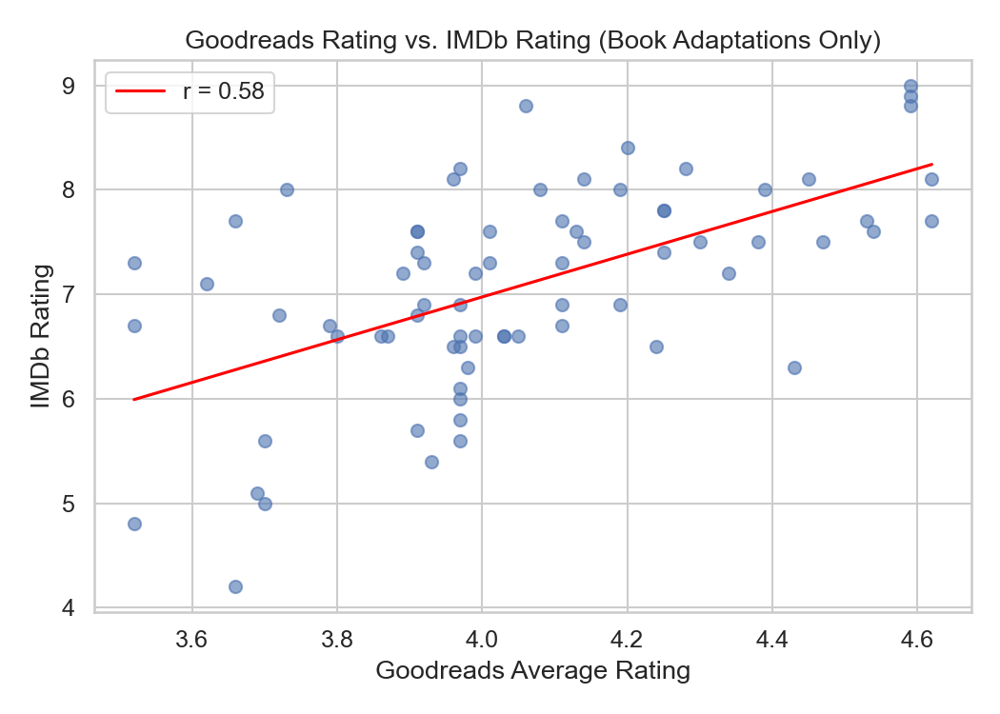

---

## 4. Statistical Models

To move beyond pairwise correlations, we fit two ordinary least squares (OLS) regression models — one predicting IMDb rating and one predicting log(domestic gross) — using the same set of film-level predictors. Genre was coded with Action as the reference category (the most common genre). MPAA rating used PG-13 as the reference (the most common rating). Release timing was captured via binary indicators for summer (May–July) and holiday (November–December) release windows. Runtime was included as a continuous predictor. Decade of release was included as a continuous variable to account for temporal trends.

After listwise deletion of rows missing any predictor, the model sample consisted of **487 films**.

### 4.1 Model 1: IMDb Rating

**Model:** `IMDb Rating ~ Runtime + MPAA + Genre + Summer + Holiday + Decade`

| Predictor | Coefficient | SE | t | p |
|---|---|---|---|---|
| Intercept | 23.02 | 5.95 | 3.87 | < 0.001 |
| Runtime (per min) | **0.011** | 0.002 | 6.85 | < 0.001 |
| MPAA: G (vs PG-13) | **+0.663** | 0.182 | 3.64 | < 0.001 |
| MPAA: PG (vs PG-13) | **+0.229** | 0.097 | 2.36 | 0.019 |
| MPAA: R (vs PG-13) | **+0.251** | 0.105 | 2.39 | 0.017 |
| Genre: Biography (vs Action) | **+0.534** | 0.209 | 2.55 | 0.011 |
| Genre: Comedy (vs Action) | −0.211 | 0.119 | −1.77 | 0.078 |
| Genre: Adventure (vs Action) | +0.059 | 0.103 | 0.58 | 0.563 |
| Genre: Drama (vs Action) | +0.079 | 0.144 | 0.55 | 0.583 |
| Summer release | −0.062 | 0.079 | −0.79 | 0.429 |
| Holiday release | +0.003 | 0.095 | 0.04 | 0.972 |
| Decade | **−0.009** | 0.003 | −2.94 | 0.003 |

**R² = 0.184, Adjusted R² = 0.163, F(12, 474) = 8.90, p < 0.001, n = 487**

**Interpretation:** Runtime is the most statistically significant predictor of IMDb rating — each additional minute of runtime is associated with a **+0.011 point** increase in rating (p < 0.001). Controlling for other factors, G-rated films rate **+0.66 points** higher than PG-13 films, and R-rated films rate slightly higher (+0.25) as well, which may reflect that R-rated films in the top 500 tend to be respected dramas or thrillers rather than typical genre fare. Biography films rate **+0.53 points** higher than Action films. Decade has a small negative effect: more recently released films rate slightly lower, consistent with survivorship bias in older films.

Release timing (summer or holiday) shows no significant effect on IMDb rating after controlling for other variables, confirming the EDA finding.

The overall model explains **18.4% of variance** in IMDb rating (adjusted R² = 0.163), which is modest but statistically significant. The compressed rating range in this top-500 sample limits the achievable R².

### 4.2 Model 2: log(Domestic Gross)

**Model:** `log(Domestic Gross) ~ Runtime + MPAA + Genre + Summer + Holiday + Decade`

| Predictor | Coefficient | SE | t | p |
|---|---|---|---|---|
| Intercept | 7.62 | 2.97 | 2.57 | 0.010 |
| Runtime (per min) | **+0.0047** | 0.001 | 5.79 | < 0.001 |
| MPAA: G (vs PG-13) | +0.085 | 0.091 | 0.94 | 0.348 |
| MPAA: PG (vs PG-13) | +0.057 | 0.048 | 1.19 | 0.235 |
| MPAA: R (vs PG-13) | **−0.127** | 0.052 | −2.44 | 0.015 |
| Genre: Biography (vs Action) | **−0.316** | 0.104 | −3.02 | 0.003 |
| Genre: Comedy (vs Action) | **−0.176** | 0.059 | −2.96 | 0.003 |
| Genre: Drama (vs Action) | −0.128 | 0.072 | −1.78 | 0.076 |
| Genre: Adventure (vs Action) | +0.035 | 0.051 | 0.67 | 0.501 |
| Summer release | +0.064 | 0.039 | 1.64 | 0.101 |
| Holiday release | +0.067 | 0.048 | 1.41 | 0.159 |
| Decade | **+0.0055** | 0.001 | 3.72 | < 0.001 |

**R² = 0.186, Adjusted R² = 0.166, F(12, 474) = 9.05, p < 0.001, n = 487**

**Interpretation:** Runtime again emerges as a highly significant predictor — each additional minute is associated with a **+0.47% increase in domestic gross** (exponentiated coefficient: e^0.0047 ≈ 1.005 per minute). R-rated films earn significantly less than PG-13 films (−12.7% on the log scale), consistent with the broader audience access of lower ratings. Biography films earn **−27%** less than Action films, and Comedy films earn **−16%** less — both statistically significant. Unlike the IMDb model, decade has a positive coefficient here (+0.006 per decade unit, or ~+0.6 points per 10 years), reflecting nominal box office growth over time. Release timing (summer, holiday) trends positively but does not reach statistical significance after controlling for other variables.

The model explains **18.6% of variance** in log(gross), nearly identical to the IMDb model. The two outcomes respond similarly to the same predictors, though with notable differences: MPAA rating matters more commercially (R-rated penalty), while rating level (G, R) matters more critically.

---

## 5. Summary and Conclusions

This analysis examined what film characteristics predict critical and commercial success among the 500 highest-grossing domestic films of all time.

**Key findings:**

1. **Runtime is the strongest predictor of both outcomes.** Longer films receive higher IMDb ratings and earn more at the box office. This effect is likely driven by genre (long Action/Adventure blockbusters dominate both lists) rather than runtime per se, and future work should examine this interaction.

2. **Genre shapes critical and commercial success differently.** Biography films rate highly on IMDb but underperform commercially. Comedy films earn less and rate slightly lower. Action and Adventure films dominate commercially but show no critical premium.

3. **MPAA rating has asymmetric effects.** G and R-rated films are rated higher on IMDb than PG-13 films (the largest category) after controls, while R-rated films earn significantly less at the box office. PG-13's commercial dominance reflects its broad audience reach.

4. **Release timing does not significantly predict success after controls.** Summer and holiday windows show positive but non-significant trends for box office gross.

5. **Newer films rate slightly lower, but gross slightly more** (in nominal terms), consistent with survivorship bias inflating older film ratings and nominal box office growth over time.

6. **Book adaptations show no raw advantage** over other films on IMDb rating (t = 0.17, p = 0.87) or domestic gross (t = 1.20, p = 0.23). Their longer average runtime (+16.6 min) and genre composition (skewed toward Drama) may drive any apparent differences. Among book adaptations, Goodreads source quality correlates moderately with IMDb rating (r = 0.578), suggesting that well-regarded source material tends to produce better-received films.

Both models explain approximately 18% of variance in their respective outcomes — modest but statistically significant. The compressed outcome range (all films are commercially successful by definition) limits achievable R². Future work will explore whether adding `is_book` as a predictor improves model fit after controlling for genre and runtime, and whether Goodreads features add predictive value within the book adaptation subset.
